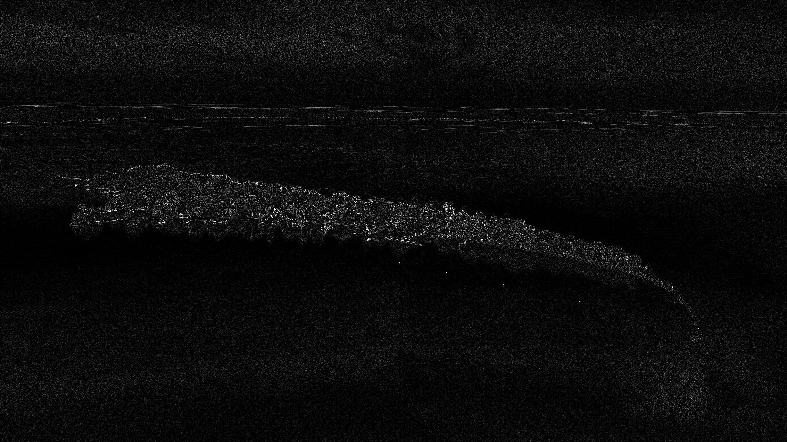

# 🖼️ Python Image Filter

A Python image filtering tool with 13 filters (grayscale, sepia, blur, edge detection and more).
Built with Pillow & NumPy. Features an interactive menu, input validation and auto file renaming.
Originally a school project, extended to be more functional and beginner-friendly. 🖼️

---

## 💡 Why This Project?

This project is great for **beginners who want to learn**:
- How images work at the pixel level
- How to use Python libraries like Pillow and NumPy
- How to structure a simple interactive Python program
- Basic concepts of image processing (colors, filters, transformations)

Feel free to clone it, run it, and modify it to learn! 🚀

---

## ✨ Features

- 13 different image filters
- Interactive menu in the terminal
- Input validation (no crashes on wrong input)
- Automatic file renaming (applying the same filter twice saves both images, no overwriting)
- All results saved in an `output/` folder

---

## 🎨 Available Filters

| # | Filter | Description |
|---|--------|-------------|
| 1 | Grayscale | Removes all color |
| 2 | Invert | Inverts all pixel colors |
| 3 | Sepia | Warm vintage brown tone |
| 4 | Red filter | Keeps only the red channel |
| 5 | Green filter | Keeps only the green channel |
| 6 | Blue filter | Keeps only the blue channel |
| 7 | Blur | Softens the image |
| 8 | Sharpen | Makes edges more defined |
| 9 | Brightness | Makes the image brighter |
| 10 | Flip Horizontal | Mirrors the image left-right |
| 11 | Flip Vertical | Flips the image upside down |
| 12 | Pixelate | Creates a pixel art effect |
| 13 | Edge Detection | Highlights the edges in the image |

---

## 📸 Sample Results

## 📸 Sample Results

| Original | Grayscale | Sepia |
|----------|-----------|-------|
|  |  |  |

| Red Filter | Edge Detection | Pixelate |
|------------|---------------|----------|
|  |  |  |
---

## 🛠️ Requirements

- Python 3.x
- Pillow
- NumPy

Install them with:
```bash
pip install pillow numpy
```

---

## 🚀 How to Run

1. Clone the repo:
```bash
git clone https://github.com/iyedferjeoui/python-image-filter.git
cd python-image-filter
```

2. Add any image and rename it `sample.jpg`

3. Run:
```bash
python main.py
```

4. Choose a filter from the menu and check the `output/` folder for the result!

---

## 📁 Project Structure
```
python-image-filter/
├── filters.py         # all filter functions
├── main.py            # interactive menu and main logic
├── sample.jpg         # input image (add your own)
├── output/            # filtered images are saved here (auto-created)
├── samples/           # example output images for preview
└── README.md
```

---

## 🏷️ Topics

`python` `image-processing` `pillow` `numpy` `filters` `beginner` `student-project` `multimedia` `computer-science`

---

## 👨‍💻 Author

**Iyed Ferjeoui** — CS Student at ISSAT Sousse, Tunisia
🔗 [GitHub](https://github.com/iyedferjeoui)
